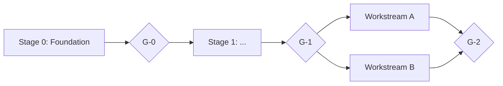

# SPEC: <Project name>

| Field | Value |
|---|---|
| Status | <e.g. Ready for task decomposition> |
| Audience | Task-writing agents, implementing agents, verifier agents, human reviewers |
| Companion files | GitHub Issues labeled `task` (the task ledger), `docs/GOTCHAS.md`, `docs/DECISIONS.md` |

## Version history

| Version | Change |
|---|---|
| 0.1.0 | Initial draft |

## 0. How to use this document

- **MUST / MUST NOT** — a hard requirement; a task that violates it fails review.
- **SHOULD / SHOULD NOT** — the default; deviation requires a written justification and a `docs/DECISIONS.md` entry.
- **DEFERRED** — explicitly out of scope for this build; the design MUST NOT preclude it, but no task implements it.
- Every agent reads Sections 0–<n> (constitution/architecture) and the orchestration section before starting any task; an agent implementing a specific task additionally reads that task's module section, the contracts it depends on, and its GitHub issue.

## 1. Vision, scope, and definition of done

<What this is, who uses it, and what "done" means for the whole build.>

## 2. Constitution (global constraints every task inherits)

<Cross-cutting rules that apply regardless of module — testing discipline,
lint/CI requirements, anything a task would otherwise have to be told
individually.>

## 3. Glossary (ubiquitous language)

<Domain vocabulary every task needs.>

## 4. Architecture

### 4.n Context map (allowed module dependencies)

<The module dependency graph — what may depend on what. Anything not listed
is forbidden.>

### 4.n Hub files

<Any file more than one task would otherwise edit — state its protocol here
explicitly (e.g. "no task edits the composition root; each module
self-registers via a discovered manifest").>

## 5. Canonical data model

<As needed.>

## 6. Bounded contexts (modules)

<One subsection per module/workstream.>

## 7. Interface contracts

<Contracts frozen after a gate — see Section 10 for the freeze rule and the
additive-exception policy.>

## 8. Cross-module flows (acceptance scenarios)

<End-to-end scenarios that exercise more than one module, used as
integration-level acceptance tests.>

## 9. Non-functional requirements

<Performance, scale, security constraints that shape task design.>

## 10. Task breakdown (DAG)

### 10.1 How to read the tasks

- Each task is sized for one focused implementation session.
- **Owns** lists the only paths the task may create or modify, plus its own tests.
- **Depends** lists tasks that must be *merged* first. Tasks with the same
  dependencies and disjoint ownership run in parallel.
- **Acceptance** items are testable statements; each becomes at least one
  automated test.
- The live task ledger is GitHub Issues labeled `task`, one per task heading
  here, carrying stage/workstream/gate/status labels and Depends-on/Owns in
  the issue body — see this skill's `resources/task-card.md`.

### 10.2 Stage overview

### 10.3 Stage 0 — <name>

#### T0.01 <title>
- **Owns:** <globs>
- **Depends:** —
- **Acceptance:** <testable statements>

<Repeat per task, per stage — see `resources/task-card.md` for the full card
shape each of these expands into before becoming an issue.>

## 11. Verification and quality gates

<What a gate requires to pass: every task in the stage merged and verified,
gate-level tests green, docs/GOTCHAS.md and docs/DECISIONS.md reviewed.>

## 12. Seed data / demo scenario

<If applicable.>

## 13. Decision log and open questions

<Running log — append, don't rewrite history.>

## 14. Orchestration model (how the work is assigned, verified, and merged)

See this skill's `resources/weight-classes.md` (Staged DAG section) for the
role table, task lifecycle, and escalation rules to fill in here — adapt to
the project's actual scale rather than copying wholesale.

## Appendix — Task card template and GitHub issue labels

See this skill's `resources/task-card.md`.
